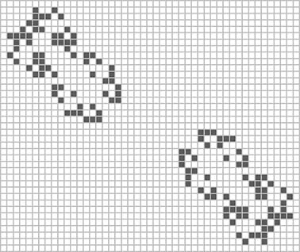

# Conway's game of life

[START](https://pavlogorbunov.github.io/Conway-game-of-life/)

### Описание

"Игра без игроков", изобретенная Джоном Конвеем в 1970 году.

Игрок не принимает активного участия в игре. Он лишь расставляет или генерирует начальную конфигурацию «живых» клеток, которые затем изменяются согласно правилам:

* В пустой (мёртвой) клетке, с которой соседствуют три живые клетки, зарождается жизнь.
* Если у живой клетки есть две или три живые соседки, то эта клетка продолжает жить; в противном случае (если живых соседей меньше двух или больше трёх) клетка умирает («от одиночества» или «от перенаселённости»)

Несмотря на простоту правил, в игре может возникать огромное разнообразие форм.

В проекте реализована возможность генерировать на игровом поле заранее подготовленные интересные стартовые конфигурации. Их можно комбинировать.

### Использование

npm i \
npm run start \
npm run build

Для просмотра работы готовой сборки на github-pages, [тык сюда.](https://pavlogorbunov.github.io/Conway-game-of-life/)

### Технологии

* Vanilla JS
* TypeScript
* Webpack

### Техническое описание

Модуль ```configurations.ts``` содержит описания стартовых конфигураций.

Для добавления новой стартовой конфигурации, необходимо добавить объект конфигурации в файл "configurations.ts" и экспортировать его.

Пример добавления простого глайдера:


```javascript
import gliderImg from '../img/glider.jpg'

const GLIDER1: Figure = {
    scheme: [
        [1, 1, 1],
        [0, 0, 1],
        [0, 1, 0]
    ],
    position: ['left', 'bottom'],
    margin: 1,
    img: gliderImg,
    name: 'Глайдер'
}
```

Пример добавления комбинации из двух больших глайдеров:



```javascript
import twoBigGlidersImg from '../img/two-big-gliders.jpg'

const twoBigGliders = new Combination([BIGGLIDER, BIGGLIDER2], twoBigGlidersImg, 'Два больших глайдера')
```

Модуль ```conway.js``` отвечает за основной алгоритм "жизни".

Модуль ```script.js``` работает с DOM.